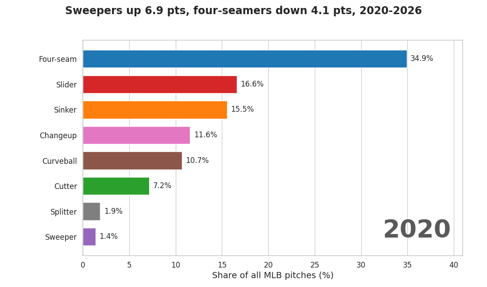

# Kaggle Datasets

Baseball-themed datasets published on Kaggle, generated with [pybaseball](https://github.com/jldbc/pybaseball) and Baseball Savant.

## Published Datasets (7)

### 1. [Japanese MLB Players Statcast (2015-2026)](https://www.kaggle.com/datasets/yasunorim/japan-mlb-pitchers-batters-statcast)

Every regular-season Statcast pitch thrown or seen by Japanese MLB players, 2015-2026.

- **Players:** 38: 28 with pitching seasons, 24 with batting seasons (14 have both: mostly pitchers who batted before the 2022 universal DH, plus Ichiro and Aoki, who pitched, and Ohtani); 153 player-season-roles
- **Files:** `japanese_mlb_pitching.csv` (130,546 rows), `japanese_mlb_batting.csv` (67,187 rows), `players.csv`, `season_summary.csv` (StatsAPI season and sabermetrics stats per player-season-role)
- **DOI:** `10.34740/kaggle/dsv/10697439`
- **Build:** generated in GitHub Actions by [`japanese-mlb-players-statcast/build.py`](japanese-mlb-players-statcast/build.py) (rebuilt September 2026: player list from MLB StatsAPI, regular season only, pitch counts equal StatsAPI's; the previous version had two wrong player ids and missing seasons)
- **Article:** [Zenn](https://zenn.dev/yasumorishima/articles/kaggle-dataset-japanese-mlb-statcast)
- **Notebook:** [Ohtani 2026: could the slump be seen early?](https://www.kaggle.com/code/yasunorim/ohtani-2026-could-the-slump-be-seen-early) (process signals against results, look-ahead free, [frozen rules](ohtani-2026-early-warning/FREEZE.md))

### 2. [MLB Bat Tracking (2024-2025)](https://www.kaggle.com/datasets/yasunorim/mlb-bat-tracking-2024-2025) 🥈

MLB bat tracking leaderboard data from Baseball Savant (2024-2025).

- **Data:** 452 batters (226 per season)
- **Columns:** 19 swing metrics (bat speed, squared-up rate, blasts, swords, etc.)
- **Size:** 46 KB
- **DOI:** `10.34740/kaggle/dsv/10699103`
- **Article:** [Zenn](https://zenn.dev/yasumorishima/articles/mlb-bat-tracking-dataset)

### 3. [MLB Pitcher Arsenal (2020-2026)](https://www.kaggle.com/datasets/yasunorim/mlb-pitcher-arsenal-2020-2025)

Every pitcher's pitch mix, velocity, spin, break, whiff rate and run value by season (Baseball Savant, regular season).

- **Files:** `pitcher_arsenal.csv` (one row per pitcher, season and pitch type), `pitcher_arsenal_wide.csv` (5,716 pitcher-seasons x 129 columns), `arsenal_changes.csv` (year over year)
- **DOI:** `10.34740/kaggle/dsv/10704532`
- **Build:** generated in GitHub Actions by [`pitcher-arsenal-dataset/build.py`](pitcher-arsenal-dataset/build.py) (rebuilt September 2026: whiff rate now equals Savant's; the previous version counted called strikes in its denominator)
- **Notebook:** [Pitcher Arsenal Analysis](https://www.kaggle.com/code/yasunorim/pitcher-arsenal-analysis) ([source](dataset3_pitcher_arsenal/))
- **Article:** [Zenn](https://zenn.dev/yasumorishima/articles/mlb-pitcher-arsenal-dataset-2020-2025)

### 4. [MLB Statcast + Bat Tracking (2024-2026)](https://www.kaggle.com/datasets/yasunorim/mlb-statcast-bat-tracking-2024-2025)

Every regular-season MLB pitch, 2024-2026, from Baseball Savant, with bat speed, swing length, attack angle and the rest of the bat tracking columns.

- **Data:** 2,141,219 pitches (711,899 / 712,528 / 716,792), 115 columns, one Parquet file per season, plus batter and pitcher season tables, a player table and `tracking_gaps.csv`
- **Build:** generated in GitHub Actions by [`dataset4_statcast_bat_tracking/build.py`](dataset4_statcast_bat_tracking/build.py). Nothing is published unless every gate passes: each day's pitches other than automatic balls/strikes equal Savant's own count (checked on all 553 days), each game's columns are either fully empty or above a measured fill floor, and games played at neutral sites without Hawk-Eye are listed one by one.
- **Tracking gaps:** games more than 30 days old whose tracking columns Savant never filled (for example no bat tracking in the 2024 opening week) are listed in `tracking_gaps.csv` instead of being hidden
- **Notebook:** [Ohtani 2026: the pattern across every MLB hitter](https://www.kaggle.com/code/yasunorim/ohtani-2026-pattern-across-every-mlb-hitter): a pre-registered test of whether a sharp bat-speed drop comes before the injured list ([pre-registration](ohtani-2026-early-warning/FREEZE_population.md); result: relative risk 1.30, 95% interval 0.58-2.29, not supported)
- **Notebook:** [Do hitters drift from normal before the IL?](https://www.kaggle.com/code/yasunorim/do-hitters-drift-from-normal-before-the-il): 20 swing, batted-ball, plate-discipline and playing-time parameters against each hitter's own normal, anomaly scores and gradient boosting against a rival model of known risk, trained on 2024-2025 and scored once on 2026 ([pre-registration](ohtani-2026-early-warning/FREEZE_anomaly.md); result: anomaly score AUC 0.49, gain over the rival +0.007 with a 97.5% interval of -0.027 to +0.042, neither supported; [diagnostics](https://www.kaggle.com/code/yasunorim/hitter-anomaly-why-shuffled-beat-real) of why its floor scored higher)
- **Replication on Triple-A 2024-2026:** the same own-normal deviations (11 non-swing parameters; Triple-A has no bat tracking) on Triple-A pitches fetched from Savant's minors search ([fetch](aaa-statcast-fetch/), [study](triple-a-anomaly-il/), [pre-registration with two amendments](ohtani-2026-early-warning/FREEZE_aaa.md)); result: anomaly score AUC 0.499 over 2,655 pre-IL rows of three seasons, anomaly model over the rival -0.009, a new season-to-date deviation over the anomaly model +0.007, all three not supported

### 5. [Baseball Savant Leaderboards (2024-2026)](https://www.kaggle.com/datasets/yasunorim/baseball-savant-leaderboards-2024)

20 Baseball Savant leaderboards, 2024-2026, as clean CSVs joinable by player id.

- **Files:** 20 CSVs: batting, pitching, fielding, catching, baserunning, park factors
- **Sources:** savant-extras 0.6.0 plus Savant's own CSV endpoints (Outs Above Average, Outfield Jump)
- **Build:** generated in GitHub Actions by [`savant-extras-dataset/build.py`](savant-extras-dataset/build.py) (rebuilt September 2026 for 2024-2026: the previous version had 7 tables where 2024 and 2025 were the same table)
- **Notebooks:** [Showcase](https://www.kaggle.com/code/yasunorim/savant-extras-showcase) · [Defense & Pitching Quality](https://www.kaggle.com/code/yasunorim/savant-extras-defense-pitching-quality)

### 6. [WBC 2026 Scouting - Statcast Data](https://www.kaggle.com/datasets/yasunorim/wbc-2026-scouting) 🥈

Pitch-by-pitch Statcast data for WBC 2026 roster players, 20 countries.

- **Batters:** 338,811 pitches, 18 countries
- **Pitchers:** 220,385 pitches, 14 countries
- **Summary:** 109 batters / 90 pitchers (per-player stats)
- **Rosters:** 308 MLB-affiliated players across 20 countries
- **Auto-update:** GitHub Actions ([`update-wbc-dataset.yml`](.github/workflows/update-wbc-dataset.yml)) — triggers on `workflow_dispatch`

### 7. [ABS Challenges: Triple-A 2025 to MLB 2026](https://www.kaggle.com/datasets/yasunorim/mlb-abs-challenges-aaa-2025-to-mlb-2026)

Every ABS (Automated Ball-Strike) challenge board on Baseball Savant, keyed by MLBAM player id.

- **Files:** `abs_challenges_players.csv` (12,132 rows x 211 columns; 15 boards: MLB 2025 spring test, MLB 2026 spring and regular season, Triple-A 2025 and 2026; batters, pitchers, catchers) and `abs_aaa2025_to_mlb2026.csv` (477 rows x 176 columns; batters and catchers on both the Triple-A 2025 and MLB 2026 regular-season boards, side by side)
- **Player columns:** every row also carries numbers for its own board's level, season and game type: bio from MLB StatsAPI, season hitting / pitching / catching (`api_*`), and Statcast search aggregates (`sc_*`: chase and zone swing/contact rates, xwOBA, exit velocity, catcher zone calls on takes), added by [`enrich.py`](abs-challenges-dataset/enrich.py)
- **Build:** generated in GitHub Actions by [`abs-challenges-dataset/build.py`](abs-challenges-dataset/build.py) with savant-extras 0.6.0; writes nothing unless every gate passes (the gates are listed in the dataset description)
- **Notebook:** [ABS Challenges: Who Wins Them, AAA to MLB](https://www.kaggle.com/code/yasunorim/abs-challenges-who-wins-them-aaa-to-mlb) ([source](abs-challenges-notebook/abs-challenges-starter.py))
- **DOI:** [10.34740/kaggle/dsv/20077454](https://doi.org/10.34740/kaggle/dsv/20077454)
- **Article:** [Japanese (Qiita)](https://qiita.com/ussu_ussu_ussu/items/57c5760b3f9917b3883f) / [English (DEV.to)](https://dev.to/yasumorishima/abs-challenges-from-triple-a-to-mlb-catchers-win-most-and-batters-who-dont-chase-win-more-499a); its pitch-level analysis (every 2026 regular-season challenge from StatsAPI, matched to the Savant totals) is in [`abs-challenges-dataset/analysis/`](abs-challenges-dataset/analysis/)

## Workflow

### WBC 2026 Scouting (automated)

Actions → `Update WBC 2026 Kaggle Dataset` → **Run workflow**

Internally: checkout `wbc-scouting` → run `generate.py` → clean `rosters.csv` → `kaggle datasets version`

Required secrets: `KAGGLE_USERNAME`, `KAGGLE_KEY`

### Other datasets (built in GitHub Actions)

Actions → `Update Kaggle Dataset` → **Run workflow** with `dataset_dir`, `version_notes` and `dry_run`.

1. Checks the title (6-50) and subtitle (20-80) lengths the Kaggle CLI enforces, before anything is built
2. If the folder has a `build.sh`, it builds the files into `<folder>/_build` and stops with nothing written when a gate fails; otherwise the folder is uploaded as is
3. `dry_run=true` builds and checks only; otherwise `kaggle datasets version` (or `create`)

Column descriptions are not accepted through the API, so after a new version they are entered in the browser from each folder's `settings.json`.

## Related

- [Kaggle Notebooks](https://github.com/yasumorishima/kaggle-competitions)
- [MLB Statcast Visualization](https://github.com/yasumorishima/mlb-statcast-visualization)
