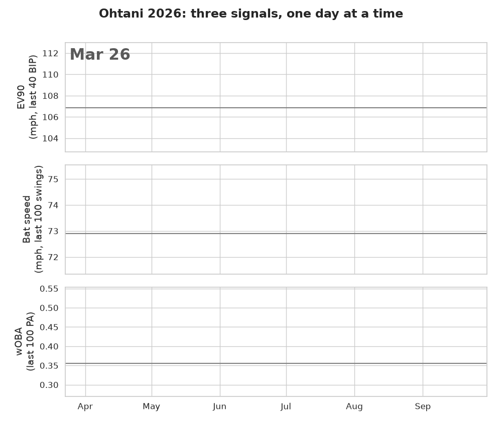

# Ohtani 2026: Could the Slump Be Seen Early?

Kaggle notebook: https://www.kaggle.com/code/yasunorim/ohtani-2026-could-the-slump-be-seen-early
Data: [Japanese MLB Players Statcast 2015-2026](https://www.kaggle.com/datasets/yasunorim/japan-mlb-pitchers-batters-statcast)

Shohei Ohtani's 2026 wOBA fell from .418 to .377 and he went on the injured list on September 8 (right biceps inflammation). The notebook asks whether his own Statcast data would have flagged it **at the time**: each day uses only earlier pitches, the flag line comes from the previous season, and the rule (`FREEZE.md`) was written before any daily series was computed. The same rule is run on nine hitter-seasons with no injured-list placement to see how often it fires anyway.

Result: his process data (bat speed, hard contact, EV90) did flag in 2026, sometimes a week or two before his results (April 26 before May 12; July 7 before July 25), but process flags also came and went with no results flag after them, the flag up on the day before the injured list was the results, and healthy seasons raise one to two of the same flags. Not pre-registered: bat speed fell 3.1 mph over the ten game days ending August 4, more than in any 10-day span of the reference seasons, and recovered.

- `ohtani_2026_early_warning.py`: the notebook source (jupytext percent format); the `.ipynb` is built from it
- `FREEZE.md`: the rule as written before the analysis
- `kernel-metadata.json`: Kaggle settings
